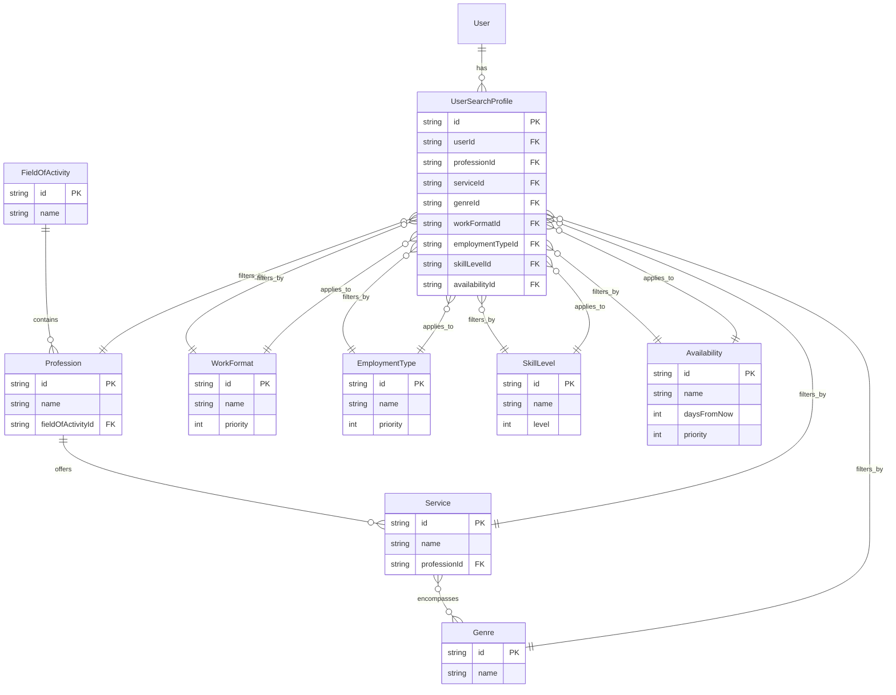

# Multi-Level Search System Architecture for Musician Discovery

## Executive Summary

This document outlines the comprehensive design for extending the current 2-level hierarchy (Field → Profession) to an 8-level hierarchical search system for musician discovery. The system will support granular filtering from broad categories to specific availability status.

---

## 1. Extended Prisma Schema

### 1.1 New Reference Models

```prisma
// ============ NEW REFERENCE TABLES ============

// Level 3: Services per Profession
model Service {
  id           String     @id @default(uuid())
  name         String     // e.g., "Сессионная работа", "Преподавание", "Студийная запись"
  professionId String
  profession   Profession @relation(fields: [professionId], references: [id], onDelete: Cascade)
  
  genres       Genre[]    // Many-to-many: Service can have multiple genres
  
  userSearchProfiles UserSearchProfile[]
  createdAt    DateTime   @default(now())

  @@unique([name, professionId])
  @@index([professionId])
}

// Level 4: Genres per Service
model Genre {
  id   String    @id @default(uuid())
  name String    @unique // e.g., "Рок", "Джаз", "Электронная музыка"
  
  services Service[]     // Many-to-many: Genre can apply to multiple services
  users    User[]        // Legacy: Keep for backward compatibility
  
  userSearchProfiles UserSearchProfile[]
  createdAt DateTime     @default(now())

  @@index([name])
}

// Level 5: Work Format Options
model WorkFormat {
  id          String              @id @default(uuid())
  name        String              @unique // e.g., "Удалённо", "На месте", "Гибрид"
  description String?
  priority    Int                 @default(0) // For ordering in UI
  
  userSearchProfiles UserSearchProfile[]
  createdAt   DateTime            @default(now())

  @@index([priority])
}

// Level 6: Employment Type Options
model EmploymentType {
  id          String              @id @default(uuid())
  name        String              @unique // e.g., "Полная занятость", "Частичная занятость", "Фриланс"
  description String?
  priority    Int                 @default(0)
  
  userSearchProfiles UserSearchProfile[]
  createdAt   DateTime            @default(now())

  @@index([priority])
}

// Level 7: Skill Level Options
model SkillLevel {
  id          String              @id @default(uuid())
  name        String              @unique // e.g., "Начинающий", "Любитель", "Профессионал"
  level       Int                 @default(0) // Numeric for comparison: 1=Beginner, 5=Master
  description String?
  
  userSearchProfiles UserSearchProfile[]
  createdAt   DateTime            @default(now())

  @@index([level])
}

// Level 8: Availability Options
model Availability {
  id          String              @id @default(uuid())
  name        String              @unique // e.g., "Сейчас", "В течение недели", "В течение месяца"
  daysFromNow Int?                // For sorting: 0=immediate, 7=week, 30=month
  description String?
  isAvailable Boolean             @default(true)
  priority    Int                 @default(0)
  
  userSearchProfiles UserSearchProfile[]
  createdAt   DateTime            @default(now())

  @@index([daysFromNow])
  @@index([priority])
}
```

### 1.2 Updated User Search Profile Join Table

```prisma
// ============ UPDATED JOIN TABLES ============

// New comprehensive search profile for users
model UserSearchProfile {
  id              String         @id @default(uuid())
  userId          String
  user            User           @relation(fields: [userId], references: [id], onDelete: Cascade)
  
  // Hierarchical chain
  professionId    String?        // Level 2
  profession      Profession?    @relation(fields: [professionId], references: [id])
  
  serviceId       String?        // Level 3
  service         Service?       @relation(fields: [serviceId], references: [id])
  
  genreId         String?        // Level 4
  genre           Genre?         @relation(fields: [genreId], references: [id])
  
  // Independent filters
  workFormatId    String?        // Level 5
  workFormat      WorkFormat?    @relation(fields: [workFormatId], references: [id])
  
  employmentTypeId String?       // Level 6
  employmentType   EmploymentType? @relation(fields: [employmentTypeId], references: [id])
  
  skillLevelId    String?        // Level 7
  skillLevel      SkillLevel?    @relation(fields: [skillLevelId], references: [id])
  
  availabilityId  String?        // Level 8
  availability    Availability?  @relation(fields: [availabilityId], references: [id])
  
  // Search preferences
  searchRadius    Int?           // In kilometers
  hourlyRateMin   Decimal?       // Minimum hourly rate
  hourlyRateMax   Decimal?       // Maximum hourly rate
  currency        String?        @default("RUB")
  
  createdAt       DateTime       @default(now())
  updatedAt       DateTime       @updatedAt

  @@index([userId])
  @@index([professionId])
  @@index([serviceId])
  @@index([genreId])
  @@index([workFormatId])
  @@index([employmentTypeId])
  @@index([skillLevelId])
  @@index([availabilityId])
}

// Keep existing UserProfession for backward compatibility
// Deprecated: Will be phased out in favor of UserSearchProfile
model UserProfession {
  id           String     @id @default(uuid())
  userId       String
  professionId String
  features     String[]   // Deprecated: Use UserSearchProfile instead
  
  user         User       @relation(fields: [userId], references: [id], onDelete: Cascade)
  profession   Profession @relation(fields: [professionId], references: [id])

  createdAt    DateTime   @default(now())

  @@unique([userId, professionId])
  @@index([userId])
  @@index([professionId])
}
```

### 1.3 Updated User Model

```prisma
model User {
  // ... existing fields ...
  
  // New search profile relationship
  userSearchProfiles UserSearchProfile[]
  
  // ... existing fields ...
}
```

---

## 2. Data Relationship Diagram



---

## 3. API Endpoint Specifications

### 3.1 Reference Data Endpoints

#### GET `/api/references/services`
Get services filtered by profession.

**Query Parameters:**
| Parameter | Type | Required | Description |
|-----------|------|----------|-------------|
| `professionId` | UUID | No | Filter services by specific profession |
| `search` | string | No | Search services by name (case-insensitive) |

**Response:**
```json
{
  "data": [
    {
      "id": "uuid",
      "name": "Сессионная работа",
      "professionId": "uuid",
      "profession": { "id": "uuid", "name": "Гитарист" },
      "createdAt": "2026-01-01T00:00:00Z"
    }
  ]
}
```

#### GET `/api/references/genres`
Get genres, optionally filtered by service.

**Query Parameters:**
| Parameter | Type | Required | Description |
|-----------|------|----------|-------------|
| `serviceId` | UUID | No | Filter genres by specific service |
| `search` | string | No | Search genres by name |

**Response:**
```json
{
  "data": [
    {
      "id": "uuid",
      "name": "Рок",
      "createdAt": "2026-01-01T00:00:00Z"
    }
  ]
}
```

#### GET `/api/references/work-formats`
Get all work format options.

**Response:**
```json
{
  "data": [
    {
      "id": "uuid",
      "name": "Удалённо",
      "description": "Работа полностью онлайн",
      "priority": 1,
      "createdAt": "2026-01-01T00:00:00Z"
    }
  ]
}
```

#### GET `/api/references/employment-types`
Get all employment type options.

**Response:**
```json
{
  "data": [
    {
      "id": "uuid",
      "name": "Полная занятость",
      "description": "Полный рабочий день, 40 часов в неделю",
      "priority": 1,
      "createdAt": "2026-01-01T00:00:00Z"
    }
  ]
}
```

#### GET `/api/references/skill-levels`
Get all skill level options.

**Response:**
```json
{
  "data": [
    {
      "id": "uuid",
      "name": "Начинающий",
      "level": 1,
      "description": "До 1 года опыта",
      "createdAt": "2026-01-01T00:00:00Z"
    }
  ]
}
```

#### GET `/api/references/availabilities`
Get all availability options.

**Response:**
```json
{
  "data": [
    {
      "id": "uuid",
      "name": "Сейчас",
      "daysFromNow": 0,
      "description": "Готов начать работу немедленно",
      "priority": 1,
      "createdAt": "2026-01-01T00:00:00Z"
    }
  ]
}
```

### 3.2 Combined Search Endpoint

#### GET `/api/references/search`
Combined endpoint for multi-level filtering with hierarchical cascade.

**Query Parameters:**
| Parameter | Type | Required | Description |
|-----------|------|----------|-------------|
| `fieldOfActivityId` | UUID | No | Level 1: Filter by field |
| `professionId` | UUID | No | Level 2: Filter by profession |
| `serviceId` | UUID | No | Level 3: Filter by service |
| `genreId` | UUID | No | Level 4: Filter by genre |
| `workFormatId` | UUID | No | Level 5: Filter by work format |
| `employmentTypeId` | UUID | No | Level 6: Filter by employment type |
| `skillLevelId` | UUID | No | Level 7: Filter by skill level |
| `availabilityId` | UUID | No | Level 8: Filter by availability |
| `city` | string | No | Filter by city |
| `search` | string | No | Text search in name/nickname/bio |

**Response:**
```json
{
  "data": [
    {
      "id": "uuid",
      "firstName": "Иван",
      "lastName": "Петров",
      "nickname": "IvanGuitar",
      "avatar": "/uploads/avatars/xxx.jpg",
      "city": "Москва",
      "fieldOfActivity": { "id": "uuid", "name": "Музыка" },
      "userSearchProfiles": [
        {
          "id": "uuid",
          "profession": { "id": "uuid", "name": "Гитарист" },
          "service": { "id": "uuid", "name": "Сессионная работа" },
          "genre": { "id": "uuid", "name": "Рок" },
          "workFormat": { "id": "uuid", "name": "Гибрид" },
          "employmentType": { "id": "uuid", "name": "Фриланс" },
          "skillLevel": { "id": "uuid", "name": "Профессионал" },
          "availability": { "id": "uuid", "name": "Сейчас" }
        }
      ]
    }
  ],
  "meta": {
    "total": 42,
    "page": 1,
    "limit": 20,
    "hasMore": true
  },
  "facets": {
    "professions": [
      { "id": "uuid", "name": "Гитарист", "count": 15 },
      { "id": "uuid", "name": "Барабанщик", "count": 10 }
    ],
    "services": [
      { "id": "uuid", "name": "Сессионная работа", "count": 25 }
    ],
    "workFormats": [
      { "id": "uuid", "name": "Удалённо", "count": 30 }
    ]
  }
}
```

### 3.3 User Profile Endpoints

#### POST `/api/users/me/search-profile`
Create or update user's search profile.

**Request Body:**
```json
{
  "professionId": "uuid",
  "serviceId": "uuid",
  "genreId": "uuid",
  "workFormatId": "uuid",
  "employmentTypeId": "uuid",
  "skillLevelId": "uuid",
  "availabilityId": "uuid",
  "searchRadius": 50,
  "hourlyRateMin": 1000,
  "hourlyRateMax": 5000,
  "currency": "RUB"
}
```

#### GET `/api/users/me/search-profiles`
Get all search profiles for current user.

#### GET `/api/users/:id/search-profiles`
Get search profiles for a specific user.

---

## 4. Frontend Component Architecture

### 4.1 Component Hierarchy


### 4.2 State Management Architecture

Using Zustand for filter state management:

```typescript
// stores/searchFilterStore.ts
interface SearchFilterState {
  // Filter values
  fieldOfActivityId: string | null;
  professionId: string | null;
  serviceId: string | null;
  genreId: string | null;
  workFormatId: string | null;
  employmentTypeId: string | null;
  skillLevelId: string | null;
  availabilityId: string | null;
  city: string;
  searchQuery: string;
  
  // UI state
  expandedLevel: number; // Which filter level is currently expanded
  isFilterPanelOpen: boolean;
  
  // Actions
  setFieldOfActivity: (id: string | null) => void;
  setProfession: (id: string | null) => void;
  setService: (id: string | null) => void;
  setGenre: (id: string | null) => void;
  setWorkFormat: (id: string | null) => void;
  setEmploymentType: (id: string | null) => void;
  setSkillLevel: (id: string | null) => void;
  setAvailability: (id: string | null) => void;
  setCity: (city: string) => void;
  setSearchQuery: (query: string) => void;
  expandLevel: (level: number) => void;
  toggleFilterPanel: () => void;
  resetFilters: () => void;
  
  // URL synchronization
  syncToURL: () => void;
  loadFromURL: () => void;
}
```

### 4.3 Cascading Dropdown Logic

```typescript
// hooks/useCascadingFilters.ts
export function useCascadingFilters() {
  const {
    fieldOfActivityId,
    professionId,
    serviceId,
    genreId,
    setService,
    setGenre,
  } = useSearchFilterStore();
  
  // Reset downstream filters when upstream changes
  useEffect(() => {
    if (!professionId) {
      setService(null);
      setGenre(null);
    }
  }, [professionId, setService, setGenre]);
  
  // Fetch services when profession changes
  const { data: services } = useQuery({
    queryKey: ['services', professionId],
    queryFn: () => referenceAPI.getServices({ professionId }),
    enabled: !!professionId,
  });
  
  // Fetch genres when service changes
  const { data: genres } = useQuery({
    queryKey: ['genres', serviceId],
    queryFn: () => referenceAPI.getGenres({ serviceId }),
    enabled: !!serviceId,
  });
  
  return { services, genres };
}
```

### 4.4 URL Synchronization

```typescript
// utils/urlSync.ts
export function syncFiltersToURL(filters: SearchFilterState) {
  const params = new URLSearchParams();
  
  if (filters.fieldOfActivityId) params.set('field', filters.fieldOfActivityId);
  if (filters.professionId) params.set('profession', filters.professionId);
  if (filters.serviceId) params.set('service', filters.serviceId);
  if (filters.genreId) params.set('genre', filters.genreId);
  if (filters.workFormatId) params.set('workFormat', filters.workFormatId);
  if (filters.employmentTypeId) params.set('employmentType', filters.employmentTypeId);
  if (filters.skillLevelId) params.set('skillLevel', filters.skillLevelId);
  if (filters.availabilityId) params.set('availability', filters.availabilityId);
  if (filters.city) params.set('city', filters.city);
  if (filters.searchQuery) params.set('q', filters.searchQuery);
  
  window.history.replaceState(null, '', `?${params.toString()}`);
}

export function loadFiltersFromURL(): Partial<SearchFilterState> {
  const params = new URLSearchParams(window.location.search);
  
  return {
    fieldOfActivityId: params.get('field'),
    professionId: params.get('profession'),
    serviceId: params.get('service'),
    genreId: params.get('genre'),
    workFormatId: params.get('workFormat'),
    employmentTypeId: params.get('employmentType'),
    skillLevelId: params.get('skillLevel'),
    availabilityId: params.get('availability'),
    city: params.get('city') || '',
    searchQuery: params.get('q') || '',
  };
}
```

### 4.5 Filter Component Design

```tsx
// components/MultiLevelFilter.tsx
export function MultiLevelFilter() {
  const { 
    expandedLevel, 
    expandLevel,
    // ... other state
  } = useSearchFilterStore();
  
  const levels = [
    { id: 1, label: 'Сфера', component: FieldSelector },
    { id: 2, label: 'Профессия', component: ProfessionSelector },
    { id: 3, label: 'Услуга', component: ServiceSelector },
    { id: 4, label: 'Жанр', component: GenreSelector },
    { id: 5, label: 'Формат работы', component: WorkFormatSelector },
    { id: 6, label: 'Тип занятости', component: EmploymentTypeSelector },
    { id: 7, label: 'Уровень', component: SkillLevelSelector },
    { id: 8, label: 'Доступность', component: AvailabilitySelector },
  ];
  
  return (
    <div className="multi-level-filter">
      {levels.map((level) => {
        const Component = level.component;
        const isExpanded = expandedLevel === level.id;
        
        return (
          <CascadingSelect
            key={level.id}
            label={level.label}
            isExpanded={isExpanded}
            onToggle={() => expandLevel(isExpanded ? 0 : level.id)}
            disabled={level.id > 1 && !isParentSelected(level.id)}
          >
            <Component />
          </CascadingSelect>
        );
      })}
    </div>
  );
}
```

---

## 5. Test Data Values

### 5.1 Services (10-15 examples across professions)

| Service Name | Profession | Description |
|--------------|------------|-------------|
| Сессионная работа | Все инструменталисты | Однократное участие в записях или выступлениях |
| Преподавание | Все | Индивидуальные или групповые занятия |
| Студийная запись | Все | Запись в профессиональной студии |
| Концертные выступления | Все | Живые выступления на мероприятиях |
| Репетиции | Все | Подготовка к выступлениям/записям |
| Звукорежиссура | Звукорежиссёр | Настройка звука в студии или на площадке |
| Сведение треков | Звукорежиссёр | Постобработка записанного материала |
| Мастеринг | Звукорежиссёр | Финальная обработка треков |
| Аранжировка | Композитор/Аранжировщик | Создание гармонической и инструментальной основы |
| Написание песен | Композитор/Автор | Создание текстов и мелодий |
| Продакшн под ключ | Продюсер | Полный цикл создания трека |
| Тур-менеджмент | Менеджер | Организация гастрольной деятельности |
| Букинг артистов | Менеджер | Поиск и бронирование площадок |
| Вокал на запись | Вокалист | Запись вокальных партий |
| Живой вокал | Вокалист | Выступления в реальном времени |

### 5.2 Genres (15-20 music genres)

| Genre Name | Description |
|------------|-------------|
| Рок | Классический рок, альтернативный, инди |
| Поп | Популярная музыка, поп-рок |
| Джаз | Джаз, фьюжн, smooth jazz |
| Блюз | Блюз, рокабилли |
| Электронная | EDM, техно, хаус, транс |
| Хип-хоп | Рэп, хип-хоп, R&B |
| Классическая | Классическая музыка, симфоническая |
| Фолк | Фолк, этника, world music |
| Метал | Метал всех поджанров |
| Панк | Панк, пост-панк, эмо |
| Регги | Регги, ска, даб |
| Кантри | Кантри, американа |
| Эстрада | Эстрадная музыка, мюзиклы |
| Детская | Детские песни |
| Саундтреки | Киномузыка, гейм-аудио |
| Академическая | Современная академическая музыка |
| Импровизационная | Свободная импровизация |

### 5.3 Work Formats

| Name | Description | Priority |
|------|-------------|----------|
| Удалённо | Работа полностью онлайн | 1 |
| На месте | Работа на площадке/в студии | 2 |
| Гибрид | Сочетание удалённой и очной работы | 3 |
| Поездки | Работа с командировками | 4 |
| Проектная | Разовая работа над проектом | 5 |

### 5.4 Employment Types

| Name | Description | Priority |
|------|-------------|----------|
| Полная занятость | Полный рабочий день, 40+ часов/неделю | 1 |
| Частичная занятость | Неполный рабочий день | 2 |
| Фриланс | Разовая/проектная работа | 3 |
| Подработка | Работа в свободное время | 4 |
| Волонтёрство | Без оплаты, для портфолио | 5 |

### 5.5 Skill Levels

| Name | Level | Description |
|------|-------|-------------|
| Начинающий | 1 | Менее 1 года опыта, обучаюсь |
| Любитель | 2 | 1-3 года, играю для себя |
| Средний | 3 | 3-5 лет, есть выступления |
| Продвинутый | 4 | 5-10 лет, профессиональный уровень |
| Профессионал | 5 | 10+ лет, студийная/концертная работа |
| Мастер | 6 | Высочайший уровень, известное имя |

### 5.6 Availability Options

| Name | Days From Now | Description | Priority |
|------|---------------|-------------|----------|
| Сейчас | 0 | Готов начать немедленно | 1 |
| На этой неделе | 1-7 | Свободен в течение недели | 2 |
| В течение месяца | 8-30 | Свободен в течение месяца | 3 |
| Следующий месяц | 31-60 | Свободен со следующего месяца | 4 |
| По договорённости | null | Гибкий график | 5 |
| Занят | null | В данный момент недоступен | 6 |

---

## 6. Migration Strategy

### 6.1 Phase 1: Database Migration

```sql
-- Create new reference tables
CREATE TABLE "Service" (
    id UUID PRIMARY KEY DEFAULT gen_random_uuid(),
    name VARCHAR(255) NOT NULL,
    profession_id UUID NOT NULL REFERENCES "Profession"(id) ON DELETE CASCADE,
    created_at TIMESTAMP WITH TIME ZONE DEFAULT NOW()
);

CREATE TABLE "Genre" (
    id UUID PRIMARY KEY DEFAULT gen_random_uuid(),
    name VARCHAR(255) NOT NULL UNIQUE,
    created_at TIMESTAMP WITH TIME ZONE DEFAULT NOW()
);

CREATE TABLE "WorkFormat" (
    id UUID PRIMARY KEY DEFAULT gen_random_uuid(),
    name VARCHAR(255) NOT NULL UNIQUE,
    description TEXT,
    priority INTEGER DEFAULT 0,
    created_at TIMESTAMP WITH TIME ZONE DEFAULT NOW()
);

CREATE TABLE "EmploymentType" (
    id UUID PRIMARY KEY DEFAULT gen_random_uuid(),
    name VARCHAR(255) NOT NULL UNIQUE,
    description TEXT,
    priority INTEGER DEFAULT 0,
    created_at TIMESTAMP WITH TIME ZONE DEFAULT NOW()
);

CREATE TABLE "SkillLevel" (
    id UUID PRIMARY KEY DEFAULT gen_random_uuid(),
    name VARCHAR(255) NOT NULL UNIQUE,
    level INTEGER DEFAULT 0,
    description TEXT,
    created_at TIMESTAMP WITH TIME ZONE DEFAULT NOW()
);

CREATE TABLE "Availability" (
    id UUID PRIMARY KEY DEFAULT gen_random_uuid(),
    name VARCHAR(255) NOT NULL UNIQUE,
    days_from_now INTEGER,
    description TEXT,
    is_available BOOLEAN DEFAULT true,
    priority INTEGER DEFAULT 0,
    created_at TIMESTAMP WITH TIME ZONE DEFAULT NOW()
);

-- Create many-to-many for Service-Genre
CREATE TABLE "ServiceGenre" (
    service_id UUID NOT NULL REFERENCES "Service"(id) ON DELETE CASCADE,
    genre_id UUID NOT NULL REFERENCES "Genre"(id) ON DELETE CASCADE,
    PRIMARY KEY (service_id, genre_id)
);

-- Create UserSearchProfile table
CREATE TABLE "UserSearchProfile" (
    id UUID PRIMARY KEY DEFAULT gen_random_uuid(),
    user_id UUID NOT NULL REFERENCES "User"(id) ON DELETE CASCADE,
    profession_id UUID REFERENCES "Profession"(id),
    service_id UUID REFERENCES "Service"(id),
    genre_id UUID REFERENCES "Genre"(id),
    work_format_id UUID REFERENCES "WorkFormat"(id),
    employment_type_id UUID REFERENCES "EmploymentType"(id),
    skill_level_id UUID REFERENCES "SkillLevel"(id),
    availability_id UUID REFERENCES "Availability"(id),
    search_radius INTEGER,
    hourly_rate_min DECIMAL(10,2),
    hourly_rate_max DECIMAL(10,2),
    currency VARCHAR(3) DEFAULT 'RUB',
    created_at TIMESTAMP WITH TIME ZONE DEFAULT NOW(),
    updated_at TIMESTAMP WITH TIME ZONE DEFAULT NOW()
);

-- Create indexes
CREATE INDEX idx_service_profession ON "Service"(profession_id);
CREATE INDEX idx_genre_name ON "Genre"(name);
CREATE INDEX idx_work_format_priority ON "WorkFormat"(priority);
CREATE INDEX idx_employment_type_priority ON "EmploymentType"(priority);
CREATE INDEX idx_skill_level ON "SkillLevel"(level);
CREATE INDEX idx_availability_days ON "Availability"(days_from_now);
CREATE INDEX idx_user_search_profile_user ON "UserSearchProfile"(user_id);
CREATE INDEX idx_user_search_profile_service ON "UserSearchProfile"(service_id);
CREATE INDEX idx_user_search_profile_availability ON "UserSearchProfile"(availability_id);
```

### 6.2 Phase 2: Seed Reference Data

```typescript
// prisma/seed.ts - Add reference data seeding
async function main() {
  // Work Formats
  await prisma.workFormat.createMany({
    data: [
      { name: 'Удалённо', description: 'Работа полностью онлайн', priority: 1 },
      { name: 'На месте', description: 'Работа на площадке/в студии', priority: 2 },
      { name: 'Гибрид', description: 'Сочетание удалённой и очной работы', priority: 3 },
      { name: 'Поездки', description: 'Работа с командировками', priority: 4 },
      { name: 'Проектная', description: 'Разовая работа над проектом', priority: 5 },
    ],
    skipDuplicates: true,
  });

  // Employment Types
  await prisma.employmentType.createMany({
    data: [
      { name: 'Полная занятость', description: 'Полный рабочий день, 40+ часов/неделю', priority: 1 },
      { name: 'Частичная занятость', description: 'Неполный рабочий день', priority: 2 },
      { name: 'Фриланс', description: 'Разовая/проектная работа', priority: 3 },
      { name: 'Подработка', description: 'Работа в свободное время', priority: 4 },
    ],
    skipDuplicates: true,
  });

  // Skill Levels
  await prisma.skillLevel.createMany({
    data: [
      { name: 'Начинающий', level: 1, description: 'Менее 1 года опыта' },
      { name: 'Любитель', level: 2, description: '1-3 года опыта' },
      { name: 'Средний', level: 3, description: '3-5 лет опыта' },
      { name: 'Продвинутый', level: 4, description: '5-10 лет опыта' },
      { name: 'Профессионал', level: 5, description: '10+ лет опыта' },
    ],
    skipDuplicates: true,
  });

  // Availability
  await prisma.availability.createMany({
    data: [
      { name: 'Сейчас', daysFromNow: 0, description: 'Готов начать немедленно', priority: 1 },
      { name: 'На этой неделе', daysFromNow: 7, description: 'Свободен в течение недели', priority: 2 },
      { name: 'В течение месяца', daysFromNow: 30, description: 'Свободен в течение месяца', priority: 3 },
      { name: 'По договорённости', daysFromNow: null, description: 'Гибкий график', priority: 4 },
    ],
    skipDuplicates: true,
  });

  // Genres
  await prisma.genre.createMany({
    data: [
      { name: 'Рок' },
      { name: 'Поп' },
      { name: 'Джаз' },
      { name: 'Блюз' },
      { name: 'Электронная музыка' },
      { name: 'Хип-хоп' },
      { name: 'Классическая музыка' },
      { name: 'Фолк' },
      { name: 'Метал' },
      { name: 'Панк' },
      { name: 'Регги' },
      { name: 'Кантри' },
      { name: 'Эстрада' },
      { name: 'Детская музыка' },
      { name: 'Саундтреки' },
      { name: 'Импровизационная музыка' },
    ],
    skipDuplicates: true,
  });
}
```

### 6.3 Phase 3: API Implementation Order

1. Add new reference endpoints to `references.ts`
2. Update user search endpoint with new filter parameters
3. Add user search profile CRUD endpoints
4. Implement aggregation/facets endpoint

### 6.4 Phase 4: Frontend Implementation Order

1. Add new API methods to `api.ts`
2. Create `searchFilterStore` with Zustand
3. Create individual filter components
4. Implement `MultiLevelFilter` component
5. Add URL synchronization utilities
6. Update `SearchPage` to use new filter system

### 6.5 Rollback Plan

- Keep `UserProfession` table for backward compatibility
- Feature flag new search functionality
- Run新旧两套系统 in parallel for 2 weeks
- Monitor performance and user feedback

---

## 7. Performance Considerations

### 7.1 Database Indexes

- All foreign keys indexed
- Composite indexes for common filter combinations
- Partial indexes for active filters only

### 7.2 Query Optimization

```typescript
// Example: Optimized search query with Prisma
const users = await prisma.user.findMany({
  where: {
    AND: [
      // Exclude current user
      { id: { not: req.userId } },
      
      // Field filter (Level 1)
      fieldOfActivityId ? { fieldOfActivityId } : {},
      
      // Profession filter (Level 2)
      professionId ? {
        userSearchProfiles: {
          some: { professionId }
        }
      } : {},
      
      // Service filter (Level 3)
      serviceId ? {
        userSearchProfiles: {
          some: { serviceId }
        }
      } : {},
      
      // Independent filters (Levels 5-8)
      workFormatId ? {
        userSearchProfiles: {
          some: { workFormatId }
        }
      } : {},
    ],
  },
  select: userSearchSelect,
  take: 20,
  skip: offset,
});
```

### 7.3 Caching Strategy

- Reference data cached for 1 hour
- Search results cached for 5 minutes
- Facets calculated with COUNT aggregation

---

## 8. Implementation Checklist

### Database
- [ ] Create new reference tables
- [ ] Create Service-Genre join table
- [ ] Create UserSearchProfile table
- [ ] Add all necessary indexes
- [ ] Seed reference data

### API
- [ ] Add GET /references/services endpoint
- [ ] Add GET /references/genres endpoint
- [ ] Add GET /references/work-formats endpoint
- [ ] Add GET /references/employment-types endpoint
- [ ] Add GET /references/skill-levels endpoint
- [ ] Add GET /references/availabilities endpoint
- [ ] Update GET /users/search with new filters
- [ ] Add POST /users/me/search-profile endpoint
- [ ] Add facets aggregation to search

### Frontend
- [ ] Update api.ts with new endpoints
- [ ] Create searchFilterStore
- [ ] Create FieldSelector component
- [ ] Create ProfessionSelector component
- [ ] Create ServiceSelector component
- [ ] Create GenreSelector component
- [ ] Create WorkFormatSelector component
- [ ] Create EmploymentTypeSelector component
- [ ] Create SkillLevelSelector component
- [ ] Create AvailabilitySelector component
- [ ] Create MultiLevelFilter component
- [ ] Implement URL synchronization
- [ ] Update SearchPage with new filter system

### Testing
- [ ] Unit tests for filter cascade logic
- [ ] API endpoint tests
- [ ] Integration tests for search flow
- [ ] Performance testing with large datasets

---

## 9. Future Enhancements

1. **Elasticsearch Integration** - For advanced full-text search
2. **Geospatial Search** - Using PostGIS for location-based filtering
3. **ML Recommendations** - Suggest users based on matching profiles
4. **Saved Searches** - Allow users to save filter combinations
5. **Search Analytics** - Track popular searches and trends
6. **Multi-language Support** - Localize genre/service names
7. **Dynamic Attributes** - Allow custom fields per profession
